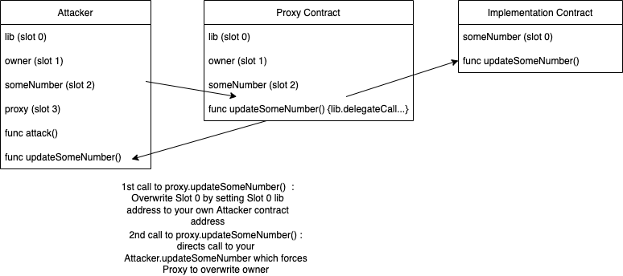

# Delegatecall Hack Using Double-call style

##### A delegatecall hack can occur when the Proxy contract using 'delegateCall' and its logic contract do not follow the same order of storage layout. This can result in its logic functions being exploited to change the value of the storage variables.

##### In this example a non-proxy approach is taken to show the difference compared to the proxy-approach shown in solidity-delegatecall-hack-single repo, however I kept the proxy-related code & commented it out to show the same result can be achieved with some minor tweaks.
#
#

  >In the repo 'solidity-delegatecall-hack-single' you can find the example code of using the delegatecall exploit to hijack a contract in a situation where contract ownership maps 1:1 with the incorrect order of an incorrect slot. However delegatecall exploits can also be performed when contract ownership does not match 1:1 of an incorrect slot. In this example you can see how the Attacker contract copies the storage layout of the NonProxy contract (the target) to force an overwrite of a variable at a specific slot. 
  
  >In the Attacker.attack() function we are able to first overwrite the address of NonProxy.Slot 0.'lib' variable because of the incorrect mapping order in the Implementation contract. Setting 'lib' to the Attacker contract address then allows Attacker to call NonProxy again and this time since 'lib' now points to Attacker and Attacker also has its own 'updateSomeNumber(uint256)' function the NonProxy performs the action implemented in Attacker, which is to overwrite Slot 1 with msg.sender and thus hijacking the contract.

  